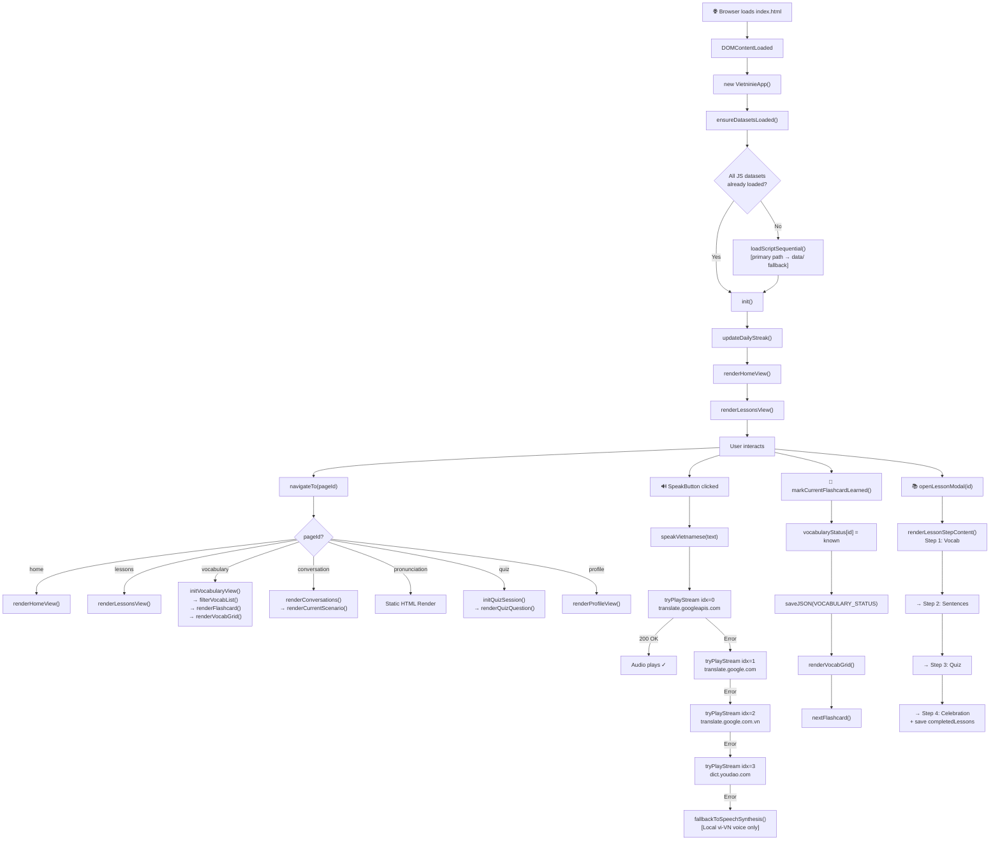
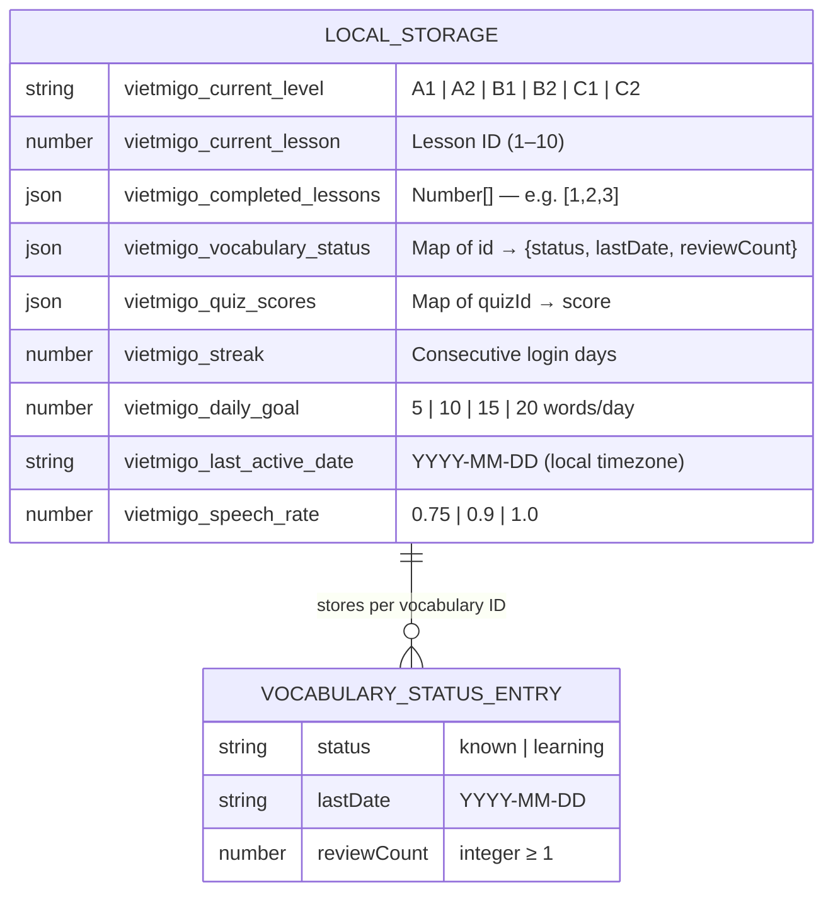
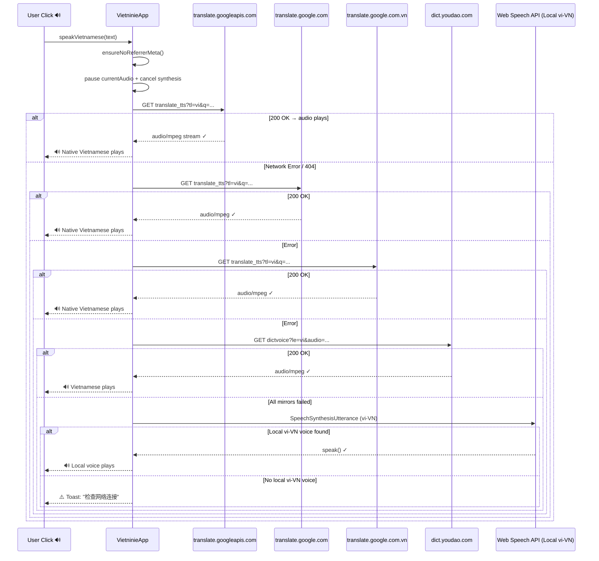

# Vietninie (越学越辣) — Class Diagram

> **Tech Stack**: Pure HTML5 + CSS3 + Vanilla JavaScript (Client-Side Only)
> **Architecture**: Single-Page Application (SPA), No Backend, No Framework

---

## Architecture Overview

```
┌─────────────────────────────────────────────────────────────────────────────────┐
│                              Browser (Client Only)                              │
│                                                                                 │
│   ┌─────────────────┐    ┌──────────────────────────────────────────────────┐  │
│   │   index.html    │───▶│              VietninieApp (app.js)               │  │
│   │  (SPA Shell)    │    │         [Single Singleton Controller]            │  │
│   └─────────────────┘    └──────────────────────────────────────────────────┘  │
│                                          │                                      │
│   ┌──────────┬──────────┬───────────┬───┴───────┬──────────┐                  │
│   │          │          │           │           │          │                   │
│   ▼          ▼          ▼           ▼           ▼          ▼                   │
│ Data Stores  │       View         Audio      Storage    Dataset               │
│ (JS Arrays)  │     Sections      Engine     (LocalStorage) Loader             │
│              │    (7 Pages)    (4 Mirrors)              (Self-Healing)         │
└─────────────────────────────────────────────────────────────────────────────────┘
```

---

## Class Diagram

```mermaid
classDiagram

    %% ═══════════════════════════════════════
    %% CORE APPLICATION CONTROLLER
    %% ═══════════════════════════════════════

    class VietninieApp {
        <<singleton>>

        %% --- Identity & Routing ---
        +String currentPage
        +String currentLevel

        %% --- Storage State ---
        +String[] completedLessons
        +Object vocabularyStatus
        +Object quizScores
        +Number streak
        +Number dailyGoal
        +Number speechRate

        %% --- Vocabulary Engine State ---
        +String vocabSearchQuery
        +String vocabLevelFilter
        +String vocabCategoryFilter
        +VocabularyItem[] filteredVocabList
        +Number vocabDisplayLimit
        +Number currentFlashcardIdx

        %% --- Lesson Modal State ---
        +LessonData activeLesson
        +Number currentLessonStep
        +Object lessonQuizAnswers
        +Number currentLessonId

        %% --- Conversation State ---
        +Number currentScenarioIdx
        +String conversationMode

        %% --- Quiz Arena State ---
        +QuizQuestion[] quizQuestions
        +Number currentQuizIdx
        +Number quizScore
        +Boolean quizAnswered

        %% --- Audio Engine State ---
        +HTMLAudioElement currentAudio
        +SpeechSynthesisVoice localVietnameseVoice
        +SpeechSynthesisVoice vietnameseVoice

        %% ── Storage Methods ──
        +loadJSON(key, defaultVal) Object
        +saveJSON(key, val) void

        %% ── Date Helpers ──
        +getLocalDateString(dateObj?) String
        +updateDailyStreak() void
        +showStreakInfo() void

        %% ── Audio Engine ──
        +ensureNoReferrerMeta() void
        +initSpeechEngine() void
        +speakVietnamese(text, rate?, callback?, btn?) void
        +fallbackToSpeechSynthesis(text, rate, callback) void
        +testSpeechSynthesis() void
        +setSpeechRate(rate) void
        +openVoiceGuideModal() void
        +closeVoiceGuideModal() void

        %% ── Router / Navigation ──
        +navigateTo(pageId) void

        %% ── Home View ──
        +renderHomeView() void
        +startCurrentLesson() void
        +startDailyReview() void

        %% ── Lessons Controller ──
        +renderLessonsView() void
        +openLessonModal(lessonId) void
        +closeLessonModal() void
        +renderLessonStepContent() void
        +nextLessonStep() void
        +prevLessonStep() void
        +answerLessonQuiz(qIdx, optIdx) void

        %% ── Vocabulary Engine ──
        +initVocabularyView() void
        +renderVocabLevelPills() void
        +setVocabLevelFilter(levelKey) void
        +renderVocabCategoryPills() void
        +setVocabCategoryFilter(categoryKey) void
        +onVocabSearchChange() void
        +filterVocabList() void

        %% ── Flashcard Engine ──
        +renderFlashcard() void
        +flipFlashcard() void
        +nextFlashcard() void
        +prevFlashcard() void
        +markCurrentFlashcardLearned() void

        %% ── Vocabulary Grid ──
        +renderVocabGrid() void
        +loadMoreVocab() void

        %% ── Conversation Controller ──
        +renderConversations() void
        +selectScenario(index) void
        +nextScenario() void
        +setConversationMode(mode) void
        +renderCurrentScenario() void
        +autoPlayDialogue() void

        %% ── Quiz Arena ──
        +initQuizSession() void
        +renderQuizQuestion() void
        +playCurrentQuizAudio() void
        +answerQuizOption(selectedIdx) void
        +nextQuizQuestion() void
        +showQuizResult() void

        %% ── Profile & Onboarding ──
        +renderProfileView() void
        +setDailyGoal(goalVal) void
        +openLevelModal() void
        +selectOnboardingLevel(levelKey) void
        +confirmLevelSelection() void
        +closeLevelModal() void

        %% ── Data Backup & Reset ──
        +exportProgressData() void
        +importProgressData(event) void
        +confirmResetProgress() void

        %% ── UI Utilities ──
        +showToast(message) void

        %% ── Async Dataset Loader ──
        +loadScriptSequential(urls) Promise
        +ensureDatasetsLoaded() Promise
        +init() Promise
    }

    %% ═══════════════════════════════════════
    %% DATA MODELS — Vocabulary
    %% ═══════════════════════════════════════

    class VocabularyItem {
        <<dataModel>>
        +String id
        +String vietnamese
        +String chinese
        +String example
        +String exampleChinese
        +String level
        +String category
        +String pronunciation
    }

    class VocabularyStatusRecord {
        <<valueObject>>
        +String status
        +String lastDate
        +Number reviewCount
    }

    class VocabCategory {
        <<dataModel>>
        +String key
        +String nameZh
        +String icon
    }

    class VietnameseLevel {
        <<dataModel>>
        +String key
        +String nameZh
        +String nameVi
        +String descZh
    }

    %% ═══════════════════════════════════════
    %% DATA MODELS — Lessons
    %% ═══════════════════════════════════════

    class LessonData {
        <<dataModel>>
        +Number id
        +String lessonNumber
        +String titleZh
        +String titleVi
        +String icon
        +String duration
        +String level
        +String summaryZh
        +LessonVocabItem[] vocabularies
        +LessonSentence[] sentences
        +LessonQuizItem[] quizzes
    }

    class LessonVocabItem {
        <<valueObject>>
        +String vi
        +String zh
        +String noteZh
        +String exampleVi
        +String exampleZh
    }

    class LessonSentence {
        <<valueObject>>
        +String vi
        +String zh
        +String breakdown
    }

    class LessonQuizItem {
        <<valueObject>>
        +String question
        +String[] options
        +Number answer
        +String explanation
    }

    %% ═══════════════════════════════════════
    %% DATA MODELS — Conversations
    %% ═══════════════════════════════════════

    class ConversationScenario {
        <<dataModel>>
        +String id
        +String titleZh
        +String titleVi
        +String icon
        +String badgeZh
        +String contextZh
        +DialogueLine[] dialogue
    }

    class DialogueLine {
        <<valueObject>>
        +String speakerZh
        +String speakerVi
        +String avatar
        +Boolean isLearner
        +String vi
        +String zh
    }

    %% ═══════════════════════════════════════
    %% DATA MODELS — Quiz Bank
    %% ═══════════════════════════════════════

    class QuizQuestion {
        <<dataModel>>
        +String id
        +String questionZh
        +String audioPrompt
        +String[] options
        +Number correctIndex
        +String explanationZh
    }

    %% ═══════════════════════════════════════
    %% DATA MODELS — Progress / Storage
    %% ═══════════════════════════════════════

    class ProgressExportData {
        <<valueObject>>
        +String app
        +String version
        +String exportDate
        +String currentLevel
        +Number streak
        +Number dailyGoal
        +Number[] completedLessons
        +Object vocabularyStatus
    }

    %% ═══════════════════════════════════════
    %% SERVICES / ENGINES
    %% ═══════════════════════════════════════

    class AudioStreamEngine {
        <<service>>
        +String[] streamUrls
        +tryPlayStream(idx) void
        +nextMirror() void
        +finish() void
    }

    class LocalStorageService {
        <<service>>
        +LEVEL: String
        +LESSON: String
        +COMPLETED_LESSONS: String
        +VOCABULARY_STATUS: String
        +QUIZ_SCORES: String
        +STREAK: String
        +DAILY_GOAL: String
        +LAST_ACTIVE_DATE: String
        +SPEECH_RATE: String
    }

    class DatasetLoader {
        <<service>>
        +loadScriptSequential(pairs) Promise
        +ensureDatasetsLoaded() Promise
        +checkPrimaryOrFallback(file) ScriptPair
    }

    class ScriptPair {
        <<valueObject>>
        +String primary
        +String fallback
    }

    %% ═══════════════════════════════════════
    %% VIEW SECTIONS (SPA Pages)
    %% ═══════════════════════════════════════

    class HomeView {
        <<view>>
        +renderGreeting() void
        +renderDailyGoalProgress() void
        +renderReviewDueCount() void
        +renderCurrentLessonCard() void
        +renderOverallLessonProgress() void
        +renderQuickModuleGrid() void
    }

    class LessonsView {
        <<view>>
        +renderLessonList() void
        +openLessonModal(lessonId) void
        +step1_VocabularyList() void
        +step2_CoreSentences() void
        +step3_InlineQuiz() void
        +step4_CompletionCelebration() void
    }

    class VocabularyView {
        <<view>>
        +renderSearchBar() void
        +renderLevelFilterPills() void
        +renderCategoryFilterPills() void
        +renderFlashcard3D() void
        +renderVocabGrid() void
        +renderLoadMoreButton() void
    }

    class ConversationView {
        <<view>>
        +renderScenarioSelector() void
        +renderDialogueBubbles() void
        +toggleLearnPracticeMode() void
        +autoPlayDialogue() void
    }

    class PronunciationView {
        <<view>>
        +renderToneSystem() void
        +renderFinalConsonants() void
        +renderPronounSystem() void
    }

    class QuizView {
        <<view>>
        +renderQuizQuestion() void
        +renderAnswerOptions() void
        +renderExplanationBox() void
        +renderProgressBar() void
        +renderResultCard() void
    }

    class ProfileView {
        <<view>>
        +renderLearningStats() void
        +renderDailyGoalSelector() void
        +renderSpeechRateSelector() void
        +renderVoiceDiagnosis() void
        +renderDataBackupControls() void
        +renderResetControl() void
    }

    %% ═══════════════════════════════════════
    %% UI COMPONENTS (Reusable)
    %% ═══════════════════════════════════════

    class ModalComponent {
        <<component>>
        +open() void
        +close() void
    }

    class LevelSelectModal {
        <<component>>
        +renderLevelOptions() void
        +selectLevel(key) void
        +confirmSelection() void
    }

    class LessonPlayerModal {
        <<component>>
        +renderStepIndicator() void
        +renderStepContent() void
        +goNext() void
        +goPrev() void
    }

    class VoiceGuideModal {
        <<component>>
        +renderVoiceStatus() void
        +testSpeech() void
    }

    class ToastNotification {
        <<component>>
        +show(message) void
        +autoDismiss(ms) void
    }

    class FlashCard3D {
        <<component>>
        +showFront() void
        +showBack() void
        +flip() void
    }

    class SpeakButton {
        <<component>>
        +triggerAudio(text, btn) void
        +addRippleAnimation() void
        +removeRippleAnimation() void
    }

    %% ═══════════════════════════════════════
    %% GLOBAL DATA STORES (Window Globals)
    %% ═══════════════════════════════════════

    class VOCABULARY_DATA {
        <<globalStore>>
        +VocabularyItem[] A1
        +VocabularyItem[] A2
        +VocabularyItem[] B1
        +VocabularyItem[] B2
        +VocabularyItem[] C1
        +VocabularyItem[] C2
    }

    class LESSONS_DATA {
        <<globalStore>>
        +LessonData[] lessons
    }

    class CONVERSATIONS_DATA {
        <<globalStore>>
        +ConversationScenario[] scenarios
    }

    class QUIZ_BANK {
        <<globalStore>>
        +QuizQuestion[] questions
    }

    class VOCAB_CATEGORIES {
        <<globalStore>>
        +VocabCategory[] categories
    }

    class VIETNAMESE_LEVELS {
        <<globalStore>>
        +VietnameseLevel[] levels
    }

    %% ═══════════════════════════════════════
    %% RELATIONSHIPS
    %% ═══════════════════════════════════════

    %% VietninieApp manages all views
    VietninieApp --> HomeView : renders
    VietninieApp --> LessonsView : renders
    VietninieApp --> VocabularyView : renders
    VietninieApp --> ConversationView : renders
    VietninieApp --> PronunciationView : renders
    VietninieApp --> QuizView : renders
    VietninieApp --> ProfileView : renders

    %% VietninieApp uses services
    VietninieApp --> LocalStorageService : persists state via STORAGE_KEYS
    VietninieApp --> AudioStreamEngine : delegates TTS playback
    VietninieApp --> DatasetLoader : loads JS data files
    DatasetLoader --> ScriptPair : creates

    %% VietninieApp manages modals
    VietninieApp --> LevelSelectModal : opens / closes
    VietninieApp --> LessonPlayerModal : opens / closes
    VietninieApp --> VoiceGuideModal : opens / closes
    VietninieApp --> ToastNotification : fires

    %% VietninieApp uses components
    VietninieApp --> FlashCard3D : controls flip state
    VietninieApp --> SpeakButton : triggers via speakVietnamese()

    %% VietninieApp reads global data stores
    VietninieApp ..> VOCABULARY_DATA : reads
    VietninieApp ..> LESSONS_DATA : reads
    VietninieApp ..> CONVERSATIONS_DATA : reads
    VietninieApp ..> QUIZ_BANK : reads
    VietninieApp ..> VOCAB_CATEGORIES : reads
    VietninieApp ..> VIETNAMESE_LEVELS : reads

    %% Data store compositions
    VOCABULARY_DATA *-- VocabularyItem : contains 5000
    LESSONS_DATA *-- LessonData : contains 10
    CONVERSATIONS_DATA *-- ConversationScenario : contains 7
    QUIZ_BANK *-- QuizQuestion : contains 20

    %% Lesson composition
    LessonData *-- LessonVocabItem : contains N
    LessonData *-- LessonSentence : contains N
    LessonData *-- LessonQuizItem : contains N

    %% Conversation composition
    ConversationScenario *-- DialogueLine : contains N

    %% Vocab status
    VietninieApp *-- VocabularyStatusRecord : tracks per word
    VietninieApp *-- ProgressExportData : serializes for export

    %% Modal inheritance
    ModalComponent <|-- LevelSelectModal : extends
    ModalComponent <|-- LessonPlayerModal : extends
    ModalComponent <|-- VoiceGuideModal : extends

    %% Level filter applies to vocabulary
    VietnameseLevel ..> VocabularyItem : filters by level
    VocabCategory ..> VocabularyItem : filters by category

    %% Audio engine mirrors
    AudioStreamEngine ..> VietninieApp : fallbackToSpeechSynthesis()
```



---

## Feature Matrix

| Feature Module | Class / Method | Data Source | Storage |
|---|---|---|---|
| 🏠 **Home Dashboard** | `renderHomeView()` | `LESSONS_DATA` | `vocabularyStatus` |
| 🔥 **Daily Streak** | `updateDailyStreak()` | — | `STREAK`, `LAST_ACTIVE_DATE` |
| 🎯 **Daily Goal Progress** | `renderHomeView()` | `vocabularyStatus` | `DAILY_GOAL` |
| 🔄 **Spaced Review** | `startDailyReview()` | `vocabularyStatus` | — |
| 📚 **10-Lesson Core Course** | `renderLessonsView()` | `LESSONS_DATA` | `COMPLETED_LESSONS` |
| 📖 **Lesson Step 1 — Vocab** | `renderLessonStepContent()` | `LessonData.vocabularies` | — |
| 📝 **Lesson Step 2 — Sentences** | `renderLessonStepContent()` | `LessonData.sentences` | — |
| ✅ **Lesson Step 3 — Inline Quiz** | `answerLessonQuiz()` | `LessonData.quizzes` | — |
| 🏆 **Lesson Step 4 — Completion** | `renderLessonStepContent()` | — | `COMPLETED_LESSONS` |
| 🔍 **Smart Vocab Search** | `filterVocabList()` | `VOCABULARY_DATA` (5,000) | — |
| 🏷️ **Level Filter A1–C2** | `setVocabLevelFilter()` | `VIETNAMESE_LEVELS` | — |
| 📂 **Category Filter (20 cats)** | `setVocabCategoryFilter()` | `VOCAB_CATEGORIES` | — |
| 🃏 **3D Flip Flashcard** | `renderFlashcard()`, `flipFlashcard()` | `filteredVocabList` | — |
| ✓ **Mark Word as Learned** | `markCurrentFlashcardLearned()` | `VocabularyItem` | `VOCABULARY_STATUS` |
| 📋 **Paginated Vocab Grid** | `renderVocabGrid()`, `loadMoreVocab()` | `filteredVocabList` | — |
| 💬 **7 Real-Life Dialogues** | `renderConversations()` | `CONVERSATIONS_DATA` | — |
| 👁️ **Learn / Practice Mode** | `setConversationMode()` | — | — |
| ▶️ **Auto-Play Full Dialogue** | `autoPlayDialogue()` | `DialogueLine[]` | — |
| 🗣️ **Tone System Diagram** | `PronunciationView` | Static HTML | — |
| 🎯 **Random 10-Q Quiz** | `initQuizSession()` | `QUIZ_BANK` (20 Q's) | `QUIZ_SCORES` |
| 🔊 **Listen to Quiz Prompt** | `playCurrentQuizAudio()` | `QuizQuestion.audioPrompt` | — |
| 📊 **Quiz Result & Feedback** | `showQuizResult()` | `quizScore`, `quizQuestions` | — |
| 🎓 **Level Selection** | `openLevelModal()` | `VIETNAMESE_LEVELS` | `LEVEL` |
| ⚙️ **Daily Goal Setting** | `setDailyGoal()` | — | `DAILY_GOAL` |
| 🎚️ **Speech Rate Control** | `setSpeechRate()` | — | `SPEECH_RATE` |
| 💾 **Export Progress (JSON)** | `exportProgressData()` | All state | — |
| 📥 **Import Progress (JSON)** | `importProgressData()` | JSON file | All keys |
| 🔄 **Reset All Progress** | `confirmResetProgress()` | — | Clears all |
| 🔊 **Online TTS (4 Mirrors)** | `speakVietnamese()` | Google/Youdao | — |
| 🛡️ **No-Referrer Guard** | `ensureNoReferrerMeta()` | DOM `<meta>` | — |
| 🔃 **Self-Healing Dataset Loader** | `ensureDatasetsLoaded()` | Root / `data/` path | — |
| 📱 **Mobile Bottom Nav** | `navigateTo()` | — | — |
| 🖥️ **Desktop Top Nav** | `navigateTo()` | — | — |
| 🍞 **Toast Notifications** | `showToast()` | — | — |

---

## Data Flow Diagram



---

## Storage Schema (localStorage)



---

## Audio Engine — 4-Mirror Waterfall



---

## Module Structure

```
vietnamese-learning/
│
├── index.html                 ← SPA Shell — 7 view sections, 3 modals, mobile nav
├── style.css                  ← Design System — CSS Variables, Components, Animations
├── app.js                     ← VietninieApp class — all controllers (1,313 lines)
│
├── vocabulary.js              ← VOCABULARY_DATA aggregator + VOCAB_CATEGORIES + VIETNAMESE_LEVELS
├── vocabulary-a1.js           ← VOCABULARY_A1[] — ~800 words
├── vocabulary-a2.js           ← VOCABULARY_A2[] — ~900 words
├── vocabulary-b1.js           ← VOCABULARY_B1[] — ~1,000 words
├── vocabulary-b2.js           ← VOCABULARY_B2[] — ~900 words
├── vocabulary-c1.js           ← VOCABULARY_C1[] — ~800 words
├── vocabulary-c2.js           ← VOCABULARY_C2[] — ~600 words (Total: 5,000 words)
│
├── lessons.js                 ← LESSONS_DATA[] — 10 structured lessons
├── conversations.js           ← CONVERSATIONS_DATA[] — 7 real-life dialogue scenarios
├── quizzes.js                 ← QUIZ_BANK[] — 20 multiple-choice questions
│
├── favicon.svg                ← Brand — 32×32 favicon
├── logo-mark.svg              ← Brand — Chili + V + Speech bubble
├── logo.svg                   ← Brand — Full horizontal logo
└── home.svg                   ← Illustration — Editorial hero image
```

---

## UI Component Inventory

| Component | HTML Element | CSS Class | Controller Method |
|---|---|---|---|
| Desktop Nav | `<nav>` | `.desktop-nav .nav-link` | `navigateTo()` |
| Mobile Bottom Nav | `<nav>` | `.mobile-bottom-nav .m-nav-item` | `navigateTo()` |
| Level Badge | `<button>` | `.level-badge-btn` | `openLevelModal()` |
| Streak Pill | `<div>` | `.streak-pill` | `showStreakInfo()` |
| Progress Bar | `<div>` | `.progress-bar-fill` | `renderHomeView()` |
| Lesson Card | `.card` | `.current-lesson-card` | `startCurrentLesson()` |
| Lesson List Item | `.card` | inline styles | `openLessonModal()` |
| Lesson Modal | `<div>` | `#modalLessonPlayer .modal-sheet` | `openLessonModal()` |
| Lesson Step Indicator | `<span>` | `#lmStepIndicator` | `renderLessonStepContent()` |
| Lesson Quiz Button | `<button>` | `.quiz-option-button` | `answerLessonQuiz()` |
| Search Input | `<input>` | `.search-input-field` | `onVocabSearchChange()` |
| Level Filter Pills | `<button>` | `.level-pill-btn` | `setVocabLevelFilter()` |
| Category Filter Pills | `<button>` | `.level-pill-btn` | `setVocabCategoryFilter()` |
| Flashcard 3D | `<div>` | `.flashcard-card` | `flipFlashcard()` |
| Flashcard Front | `<div>` | `.fc-face.front` | `renderFlashcard()` |
| Flashcard Back | `<div>` | `.fc-face.back` | `renderFlashcard()` |
| Vocab Grid Tile | `<div>` | `.vocab-item-tile` | `renderVocabGrid()` |
| Load More Button | `<button>` | `#btnLoadMoreVocab` | `loadMoreVocab()` |
| Scenario Tabs | `<button>` | `.level-pill-btn` | `selectScenario()` |
| Chat Bubble | `<div>` | `.chat-bubble-row` | `renderCurrentScenario()` |
| Blurred Chinese | `<div>` | `.chat-zh-line.blurred` | `setConversationMode()` |
| Auto-Play Button | `<button>` | inline | `autoPlayDialogue()` |
| Quiz Card | `<div>` | `#quizPlayCard` | `renderQuizQuestion()` |
| Quiz Option | `<button>` | `.quiz-option-button` | `answerQuizOption()` |
| Quiz Progress Bar | `<div>` | `#quizProgFill` | `renderQuizQuestion()` |
| Quiz Result Card | `<div>` | `#quizResultCard` | `showQuizResult()` |
| Level Select Modal | `<div>` | `#modalLevelSelect` | `openLevelModal()` |
| Voice Guide Modal | `<div>` | `#modalVoiceGuide` | `openVoiceGuideModal()` |
| Speak Button | `<button>` | `.btn-speak` | `speakVietnamese()` |
| Toast | `<div>` | `.toast-pill` | `showToast()` |
| Export Button | `<button>` | inline | `exportProgressData()` |
| Import Button + Input | `<button>` + `<input file>` | inline | `importProgressData()` |
| Reset Button | `<button>` | inline | `confirmResetProgress()` |
